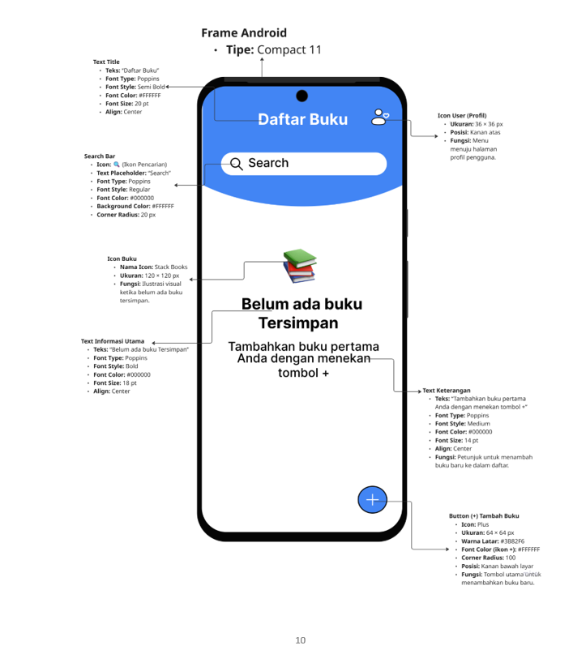
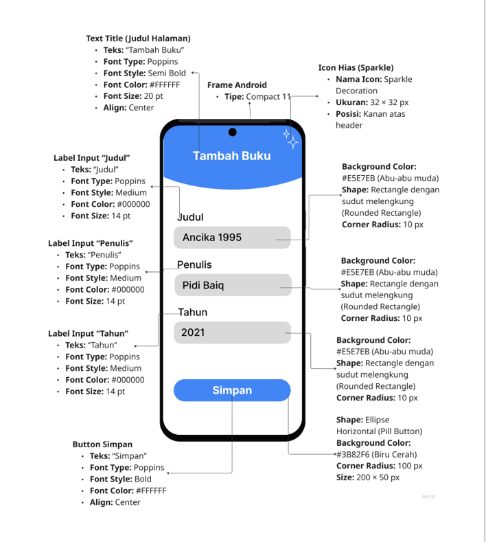
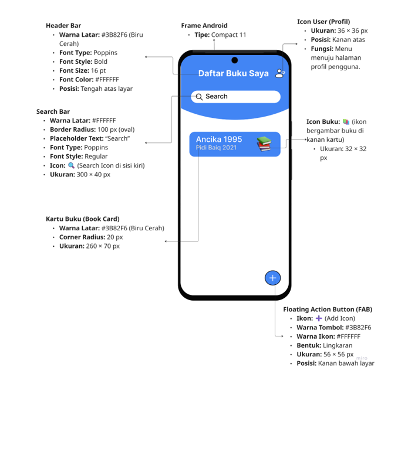
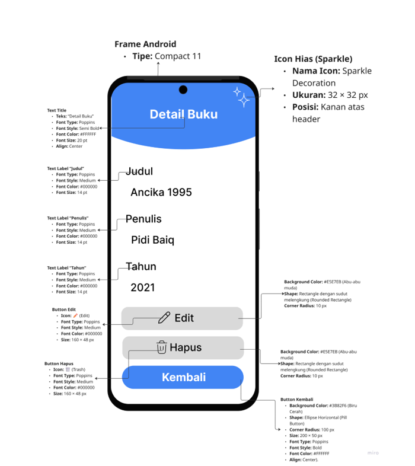
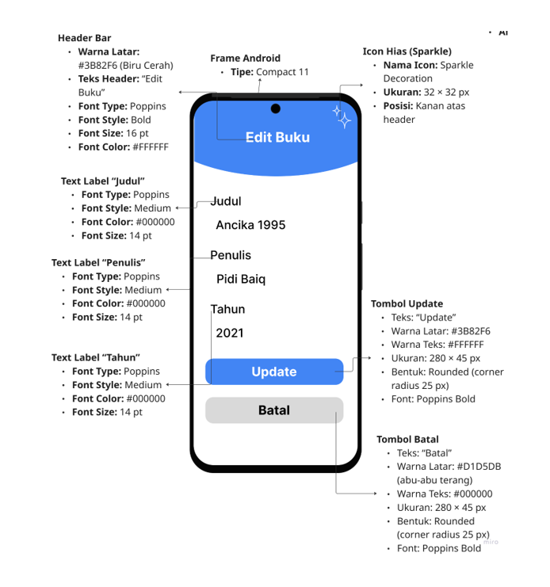
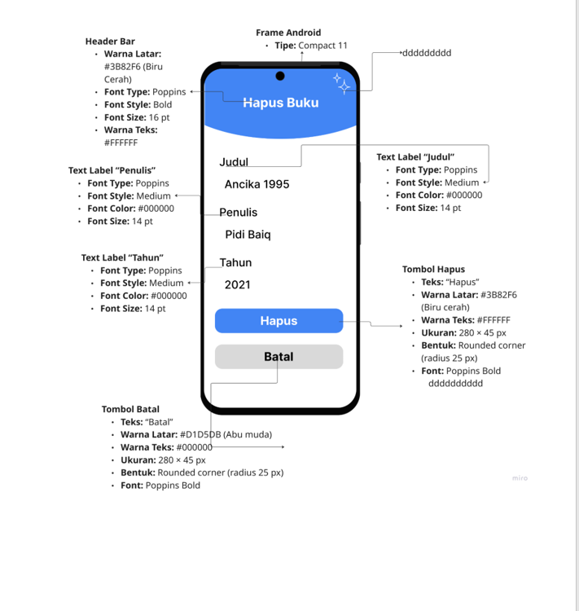
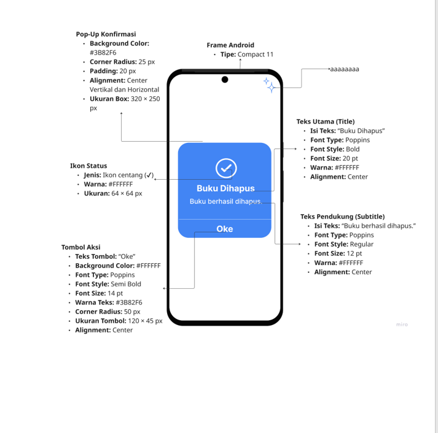
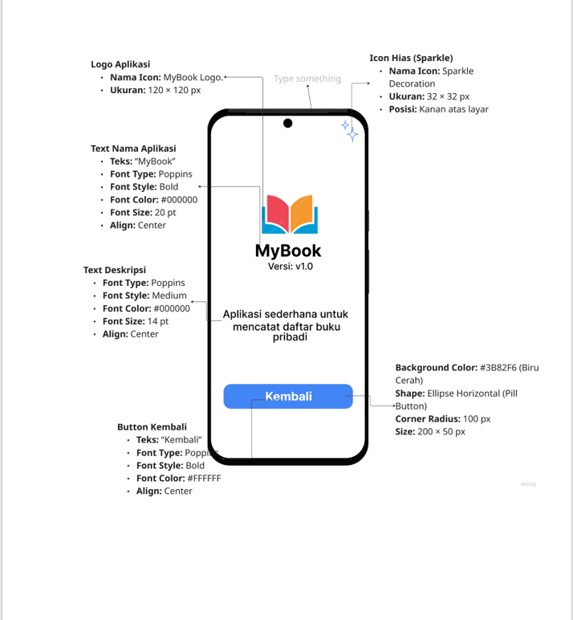

#  MyBook – UI/UX Documentation  
## Phase I

###  1. Tampilan MYBOOK 

---

###  2. Tampilan Daftar Buku 

---

###  3. Tampilan Tambah Buku 

---

###  4. Tampilan Setelah Tambah Buku

---

###  5. Tampilan Detail Buku

---

###  6. Tampilan Edit Buku

---

###  7. Tampilan Hapus Buku

---

###  8. Tampilan Konfirmasi Hapus

---

###  9. Tampilan Aplikasi MY Book

---

